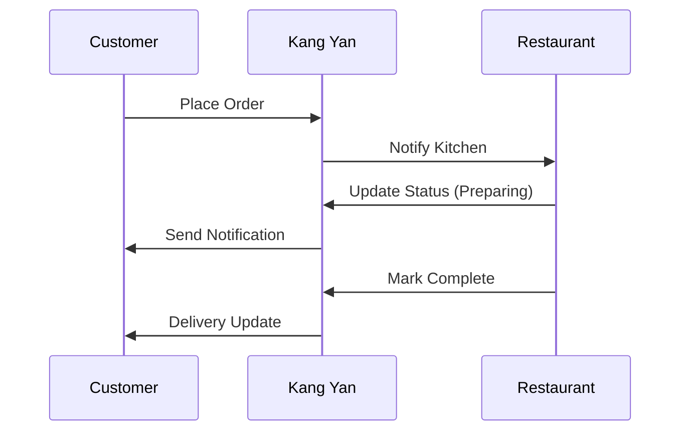

## Overview

Kang Yan provides a comprehensive ordering platform that streamlines restaurant operations and customer experiences. You manage menus, track orders in real-time, and handle different user roles seamlessly. Key features include menu customization, order tracking with notifications, and role-based access for customers and admins.

<Columns cols={3}>
  <Card title="Menu Customization" icon="edit-3" href="#menu-customization">
    Tailor your menu with categories, items, and pricing to match your offerings.
  </Card>
  <Card title="Order Tracking" icon="map-pin" href="#order-tracking">
    Monitor orders from placement to delivery with instant updates.
  </Card>
  <Card title="User Roles" icon="users" href="#user-roles">
    Assign permissions for customers and restaurant admins efficiently.
  </Card>
</Columns>

## Menu Customization and Category Management

Customize your restaurant's menu dynamically to reflect daily specials, seasonal items, or promotions. Create categories like appetizers, mains, and desserts, then add items with descriptions, prices, and images. Kang Yan supports unlimited nesting for subcategories, ensuring flexibility.

<Steps>
  <Step title="Create Category" icon="folder-plus">
    Navigate to the admin dashboard and select `Menu > Categories`. Click `New Category` and enter details like name and description.
  </Step>
  <Step title="Add Menu Items" icon="plus">
    Within a category, add items. Specify price, availability, and allergens.
  </Step>
  <Step title="Publish Changes" icon="upload">
    Review and publish. Changes appear instantly on the customer app.
  </Step>
</Steps>

Integrate programmatically via API:

<CodeGroup tabs="JavaScript,Python">
  ```javascript
  const response = await fetch('https://api.example.com/v1/menus/categories', {
    method: 'POST',
    headers: { 'Authorization': `Bearer ${YOUR_API_KEY}`, 'Content-Type': 'application/json' },
    body: JSON.stringify({
      name: 'Appetizers',
      description: 'Starters and small plates'
    })
  });
  const category = await response.json();
  console.log(category.id);
  ```
  ```python
  import requests
  headers = {
      'Authorization': f'Bearer {YOUR_API_KEY}',
      'Content-Type': 'application/json'
  }
  data = {'name': 'Appetizers', 'description': 'Starters and small plates'}
  response = requests.post('https://api.example.com/v1/menus/categories', json=data, headers=headers)
  category = response.json()
  print(category['id'])
  ```
</CodeGroup>

<Callout kind="tip">
  Use images up to 2MB for menu items to maintain fast loading times.
</Callout>

## Order Tracking and Real-Time Notifications

Track every order from submission to completion with live updates. Customers receive push notifications, while admins see dashboard refreshes. This feature reduces wait times and improves satisfaction.



<Callout kind="info">
  Enable webhooks for custom notifications to your systems.
</Callout>

Set up webhook for order updates:

<ParamField path="orderId" param-type="string" required="true">
  Unique order identifier.
</ParamField>

<ParamField header="X-KangYan-Signature" param-type="string" required="true">
  HMAC signature for verification.
</ParamField>

## User Roles for Customers and Restaurant Admins

Kang Yan supports distinct roles to secure access. Customers view menus and orders, while admins manage everything.

<Tabs>
  <Tab title="Customer Role" icon="user">
    Customers place orders and track status.

    <Steps>
      <Step title="Browse Menu">
        View categories and items.
      </Step>
      <Step title="Place Order">
        Add to cart and checkout.
      </Step>
    </Steps>
  </Tab>
  <Tab title="Admin Role" icon="shield">
    Admins control operations.

    <Steps>
      <Step title="Manage Users">
        Assign roles via dashboard.
      </Step>
      <Step title="View Reports">
        Access analytics on sales and orders.
      </Step>
    </Steps>
  </Tab>
</Tabs>

<Expandable title="Advanced Role Permissions" default-open="false">
  Customize permissions like `read:orders` or `write:menus` using RBAC.
</Expandable>

These features empower you to run a efficient ordering platform. Explore integrations next for deeper customization.