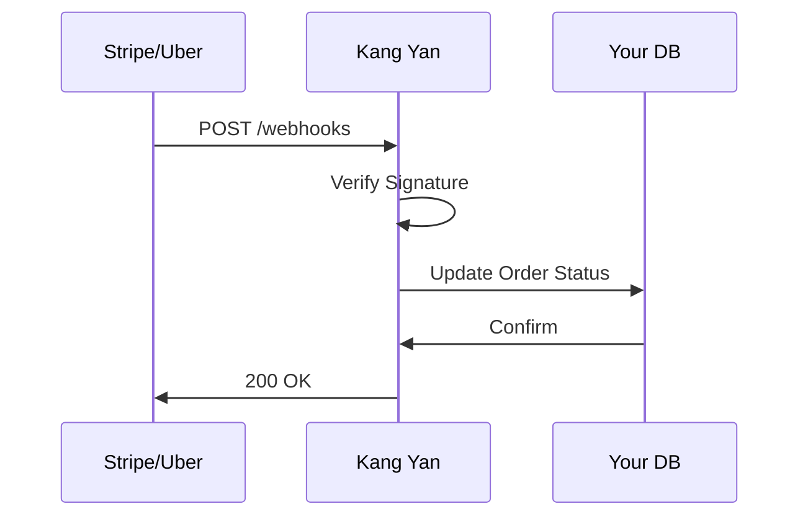

## Overview

Kang Yan supports seamless integrations with popular payment processors, delivery services, and custom webhooks. You can extend your ordering platform by connecting to services like Stripe for payments, Uber Eats for deliveries, and webhooks for real-time notifications. These integrations enable automated order processing, reducing manual work and improving customer experience.

<Callout kind="info">
  Before starting, ensure you have an active Kang Yan account and API access. Generate your API key from the dashboard at `https://dashboard.example.com/settings/api`.
</Callout>

## Popular Integrations

<Columns cols={3}>
  <Card title="Stripe" icon="credit-card" href="#stripe">
    Accept payments securely with Stripe's gateway.
  </Card>
  <Card title="Uber Eats" icon="truck" href="#uber-eats">
    Automate delivery fulfillment.
  </Card>
  <Card title="Webhooks" icon="zap" href="#webhooks">
    Receive real-time event notifications.
  </Card>
</Columns>

## Stripe Payment Gateway

Set up Stripe to handle payments for orders placed through Kang Yan.

<Steps>
  <Step title="Create Stripe Account" icon="user-plus">
    Sign up at `https://dashboard.stripe.com/register` and obtain your secret key (`sk_test_...` for testing).
  </Step>
  <Step title="Configure in Dashboard">
    Navigate to `https://dashboard.example.com/settings/payments` in Kang Yan. Enter your Stripe secret key and webhook endpoint.
  </Step>
  <Step title="Test Payment Flow">
    Create a test order via the API and verify the charge succeeds.
  </Step>
</Steps>

<CodeGroup tabs="JavaScript,Python">
  ```javascript
  const stripe = require('stripe')('sk_test_YOUR_STRIPE_SECRET');

  const paymentIntent = await stripe.paymentIntents.create({
    amount: 2000, // $20.00
    currency: 'usd',
    metadata: { orderId: 'kangyan_123' }
  });
  ```
  ```python
  import stripe
  stripe.api_key = 'sk_test_YOUR_STRIPE_SECRET'

  payment_intent = stripe.PaymentIntent.create(
    amount=2000,  # $20.00
    currency='usd',
    metadata={'orderId': 'kangyan_123'}
  )
  ```
</CodeGroup>

## Uber Eats Delivery Integration

Integrate Uber Eats using their Marketplace API. Choose between direct API calls or webhook-based syncing.

<Tabs>
  <Tab title="API Integration" icon="code">
    Use the Uber Eats API to fulfill orders automatically.

    <Request tabs="cURL,JavaScript">
      ```bash
      curl -X POST https://api.uber.com/v1/marketplace/orders \
        -H "Authorization: Bearer YOUR_UBER_TOKEN" \
        -H "Content-Type: application/json" \
        -d '{
          "order_id": "kangyan_123",
          "status": "accepted"
        }'
      ```
      ```javascript
      const response = await fetch('https://api.uber.com/v1/marketplace/orders', {
        method: 'POST',
        headers: {
          'Authorization': 'Bearer YOUR_UBER_TOKEN',
          'Content-Type': 'application/json'
        },
        body: JSON.stringify({
          order_id: 'kangyan_123',
          status: 'accepted'
        })
      });
      ```
    </Request>
  </Tab>
  <Tab title="Webhook Sync" icon="zap">
    Configure Uber Eats to send order updates to your Kang Yan webhook.
  </Tab>
</Tabs>

## Webhooks for Custom Notifications

Webhooks allow third-party services to push events to Kang Yan in real time, such as order confirmations or delivery updates.

<ParamField path="event" param-type="string" required="true">
  The webhook event type, e.g., `order.paid` or `delivery.completed`.
</ParamField>

<ParamField header="Kang-Yan-Signature" param-type="string" required="true">
  HMAC signature for verifying webhook authenticity using your API secret.
</ParamField>



<Expandable title="Advanced Webhook Security" default-open="false">
  Always validate the `Kang-Yan-Signature` header:

  ```javascript
  const crypto = require('crypto');
  const signature = req.headers['kang-yan-signature'];
  const expected = crypto.createHmac('sha256', 'YOUR_API_SECRET')
    .update(JSON.stringify(req.body))
    .digest('hex');
  ```
</Expandable>

<Callout kind="tip">
  Monitor webhook deliveries in your Kang Yan dashboard at `https://dashboard.example.com/webhooks`. Retry failed deliveries automatically.
</Callout>

## Next Steps

Explore more advanced setups:

<Columns cols={2}>
  <Card title="Custom Plugins" icon="puzzle" href="/configuration">
    Build your own extensions.
  </Card>
  <Card title="API Reference" icon="book-open" href="/quickstart">
    Full endpoint documentation.
  </Card>
</Columns>